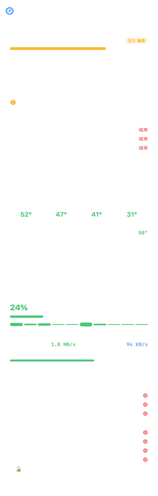

# PulseBar

> 把 Mac 的状态放在菜单栏里：温度、内存压力、CPU、网络、磁盘、电池、风扇转速。
> **它不会偷偷关掉你的微信。**

一款纯本地的 macOS 菜单栏系统监控小工具。不联网、不注册、不自动杀进程。



## 特点

- **菜单栏实时显示**：内存压力 / CPU 温度 / 网络速率等，显示项可自选
- **只诊断，不动手**（默认）：内存紧张时只给建议，关不关由你决定
- **保护名单**：微信、输入法、系统进程默认受保护；任意程序可一键 🔒 永久保护
- **三种清理模式**：手动 / 提醒 / 自动，默认永远是「手动」
- **按机器自适应**：自动读取你的内存容量与核心数，8GB 和 128GB 用各自的标准
- **风扇自适应**：带风扇的机型自动显示转速，MacBook Air 则完全不显示这一栏
- **不联网**：没有任何网络请求，不含任何统计

## 下载

前往 [Releases](../../releases) 下载最新版 `PulseBar-x.x.zip`，解压后把 `PulseBar.app` 拖进「应用程序」。

首次打开若提示「无法验证开发者」：右键点图标 → 打开 → 再点一次「打开」。

## 兼容性

- 仅支持 **Apple 芯片**（M1 / M2 / M3 / M4 全系列，含 MacBook Air、MacBook Pro、Mac mini、iMac、Mac Studio、Mac Pro）
- 需要 **macOS 14.0** 或更高版本
- 一份安装包通用全部 M 系列机型，无需区分

## 常见问题

**装好了但菜单栏没有图标？**
macOS 26 (Tahoe) 起，第三方菜单栏图标需要在「系统设置 → 菜单栏」里单独授权。
PulseBar 检测不到图标时会自己弹窗提醒你。

**会不会偷偷关掉我的程序？**
默认不会。默认模式是「只诊断」，结束任何进程都必须你亲自点击并二次确认。
即使用户主动开启「自动模式」，也只清理后台进程，并受保护名单约束。

## 从源码构建

只需 Command Line Tools，不需要安装 Xcode：

```bash
git clone <你的仓库地址>
cd PulseBar
./build.sh --install
```

## 反馈

有问题或想要的功能，欢迎提 [Issue](../../issues)，或邮件联系。
